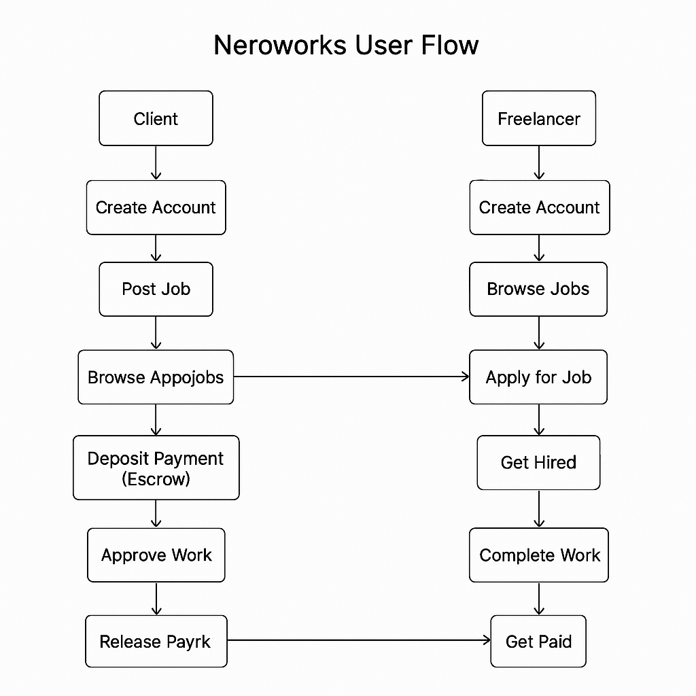

# Neroworks – Gasless Freelancing on NERO Chain

## 🚀 Elevator Pitch
**Neroworks** is a Web3 freelancing platform built on NERO Chain that makes it possible for anyone to work or hire talent without worrying about gas fees, wallets, or crypto complexity — thanks to Account Abstraction and Paymaster integration.

## 🎯 Problem
Freelancers in emerging markets and non-crypto natives face friction when trying to earn onchain:
- Complex wallet setup & private keys
- High or unpredictable gas fees
- Poor UX for job management and payments

## 🌟 Solution
Neroworks provides a gasless, wallet-free experience using:
- **NERO's Account Abstraction (AA)** to allow social login, smart wallets, and simplified interactions.
- **NERO's Paymaster API** to let clients/platform sponsor gas fees or allow freelancers to pay using stablecoins or project tokens.
- **Blockspace 2.0** for fair, MEV-resistant job contract execution.

## 👥 User Flow

[](https://mermaid.live/edit#pako:eNqVVF1v2jAU_SuWn2mVACEhb4wxiW0tqHSaNiFVJr6hHv6IbGddB_nvc0JghLCivdm-555z7r22tzhRFHCMQb9nZK2JWMqlROjLYvKwQLvdzY3aoo-zdwsUo0wZa1rB0Xz-eToePU5n9yXI5CvBLsDmo293k_vHEiLIBsxepmIuEbsWkYYE2E8w57DJYvww-1oiuEo2QJ9Wr3uuRn6hHHhXWzi4sjX6MraukmQZZ2CerNrTHvQq-SMqVfpC8KRIDRyIOeE5xs6tgbQVqA35W2qqVWMw23KJkLGayTViFM0_NU4kEdA4eCGcgx1RqsGYRkQrXkGLk4lco7fM8iY_BZNollmmZOM8cb2UdkrRhyaDscTm5kS3MZFr-j_Uqk2ZagBOZAK6Hcu0creX8Lc9HPr9f_IpV8QiIlQu7dv8x_leEyibqV7aZbg3wbKzhv5T3jIBzoLIage4g9eaURxbnUMHC9CClFtcuVli-wzu0uDYLSnRmyVeysLlZER-V0oc0rTK1884Tgk3bpdnlFiof44jBCQFPS4N4TjoVRQ43uJfbhfeRmE_Gvph6A2GXuSCrzj2e8FtNwqDIPK73d6wFwyKDv5diXoOH3ie5_tRf-gNun2XAZRZpe_2_1b1fRV_AAxMhdg)

**Freelancer:**
1. Visits app → logs in with email (AA)
2. Browses gigs, applies, gets hired
3. Delivers work → gets paid, no gas paid

graph TD
    A2[Freelancer Journey] --> B2[Create Account]
    B2 --> C2[Browse Jobs]
    C2 --> D2[Apply for Job]
    D2 --> E2[Get Hired]
    E2 --> F2[Complete Work]
    F2 --> G2[Get Paid (Release from Escrow)]

**Client:**
1. Logs in → posts job
2. Reviews applicants → hires → deposits escrow
3. Approves delivery → funds released automatically

graph TD
    A[Client Journey] --> B[Create Account]
    B --> C[Post Job]
    C --> D[Review Freelancer Applications]
    D --> E[Hire Freelancer]
    E --> F[Deposit Payment (Escrow)]
    F --> G[Approve Work]
    G --> H[Release Payment]

(Diagrams in `/assets`)

## 🧠 AA & Paymaster Vision (30%)
Neroworks showcases a clear integration of:
- **Account Abstraction**: Walletless onboarding, session keys for job tasks, and programmable smart accounts.
- **Paymaster**: Sponsored transactions for freelancers, flexible gas logic, ERC20-based gas payments.

## 🧩 Architecture Overview

- **Frontend**: React / Next.js
- **Smart Contracts**: Job escrow, milestone tracking, payment release
- **NERO Chain SDKs**: For AA smart accounts and Paymaster logic
- **Optional backend**: Metadata storage, notifications, job feeds

graph LR
    A[Frontend (React App)] --> B[Backend API (Node.js)]
    B --> C[Database (MongoDB)]
    B --> D[Smart Contracts (NERO Chain)]
    D --> E[Escrow Handling]
    D --> F[Payment Release]
    B --> G[NERO Chain Integration]
    G --> H[Paymaster API]
    G --> I[Account Abstraction (AA)]

## 🎨 Innovation & Relevance 
Neroworks creatively applies NERO’s AA and gasless infra to an untapped segment: global freelancers and startups. It aligns with themes like usability, AA innovation, and real-world adoption.

## 🌍 User Impact 
Designed for:
- **Newcomers & Non-Crypto Users**
- **Emerging market freelancers**
- **Startups needing agile hiring**

## 📈 Ecosystem Fit 
- Shareable, useful, and visible on X/Farcaster
- Encourages real-world use of NERO
- Flexible token gas logic makes it useful for any builder

## 🛣️ Continuity 
**Wave 2 Goals:**
- Build MVP (job post, hire, pay)
- Paymaster and AA integrated
- Deploy to NERO testnet with smart accounts

**Wave 3+:**
- Add reputation NFTs, onchain reviews
- Mobile-friendly version
- Token integrations for fee logic

## 📹 Video Demo
See `video-link.txt` for demo.

---

Thank you for considering Neroworks 🙌

We believe this project can show the real power of NERO’s AA and Paymaster to empower builders and workers around the world.

